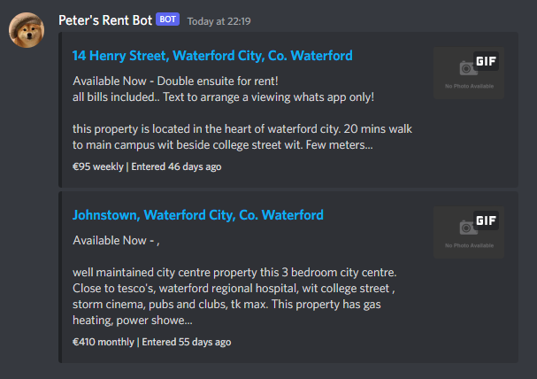

# Rent.ie Notify



Scans rent.ie for new listings and uses a Discord webhook to notify you

## Why?

Checking every hour is annoying, so just automate the process!

## How do I use it?

> Make sure you have [Node](https://nodejs.org/en/) installed.

* Clone the repo and `cd` into it.
* `npm i`
* Fill out your details in `.env.example` and rename it to `.env`
* Comment out the following line from `index.js` if you don't want to use Discord webhooks:

```js
await sendToDiscord(...)
```

* `npm run dev`

> If you want to automate the process with [GitHub Actions](https://github.com/features/actions) there is a workflow file provided; Fork the repo and set the [secrets](https://docs.github.com/en/actions/security-guides/encrypted-secrets).

## How do I contribute?

If it is something small, make a change directly and make a pull request.

If it is something that requires testing:

* Install [act](https://github.com/nektos/act).
* Rename `.env.example` to `.env`
* Run `act --secret-file .env workflow_dispatch` to test changes.

## License

Licensed under the MIT license.
